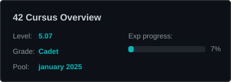

<div align="center">

# `{ Ahmed B. }`

<a href="https://git.io/typing-svg"></a>

<br/>

[](www.linkedin.com/in/ahmed-boulahdjar-1912522b1)
[](#)
[](mailto:ahmedboulahdjar@gmail.com)

</div>


## `> whoami`

```yaml
name: Ahmed B.
location: Between France (Paris) & Switzerland (Bern)
current_role: Fullstack Developer (1+ year in production)
education: 42 School
interests: [Systems Programming, Web Development, Game Modding]
motto: "I don't just use the tools — I understand what's under the hood."
```


## `> node current_work.js`

```js
const currentlyWorkingOn = {
  "42":       "Advancing through the 42 cursus — next projects loading...",
  "work":     "Building fullstack apps with React/Next.js & Java/Spring",
  "side":     "FiveM scripts & game server modding in Lua/TS",
  "learning": "Deepening C/C++ systems knowledge & exploring new frameworks"
};
```


## `> cat tech_stack.md`

<table>
<tr><td valign="top" width="33%">

### Low Level
<div align="center">


</div>

</td><td valign="top" width="33%">

### Frontend
<div align="center">


</div>

</td><td valign="top" width="33%">

### Backend & Tools
<div align="center">


</div>

</td></tr>
<tr><td colspan="3" align="center">

### Also fluent in


</td></tr>
</table>


## `> ls projects/`

<details open>
<summary><b>📂 42 Projects</b></summary>
<br/>

<!-- 42_PROJECTS_START -->
| Project | Description | Mark | Language |
|:--------|:------------|:----:|:--------:|
| [**Libft**](https://github.com/Bouly/42-libft) | Custom C standard library | **125** |  |
| [**ft_printf**](https://github.com/Bouly/42-ft_printf) | Custom printf implementation | **100** |  |
| [**get_next_line**](https://github.com/Bouly/42-get_next_line) | Reading a line from a file descriptor | **101** |  |
| [**push_swap**](https://github.com/Bouly/42-Push_Swap) | Sorting algorithm — minimum operations | **86** |  |
| [**fract-ol**](https://github.com/Bouly/42-Fract-ol) | Real-time fractal renderer with zoom | **100** |  |
| [**pipex**](https://github.com/Bouly/42-Pipex) | Unix pipe mechanism reproduction | **100** |  |
| [**minishell**](https://github.com/Bouly/Minishell) | Custom Unix shell — parsing, pipes, redirections | **100** |  |
| [**Philosophers**](https://github.com/Bouly/Philosophers) | Dining philosophers — multithreading & mutex sync | **100** |  |
| [**cub3d**](https://github.com/Bouly/cub3d) | RayCaster with miniLibX | **103** |  |
| [**NetPractice**](https://github.com/Bouly/NetPractice) | Networking concepts and configuration | **100** |  |
| [**CPP Module 00**](https://github.com/Bouly/CPP00) | C++ - Namespaces, classes, member functions | **80** |  |
| [**CPP Module 01**](https://github.com/Bouly/CPP01) | C++ - Memory allocation, pointers, references | **87** |  |
| [**CPP Module 02**](https://github.com/Bouly/CPP02) | C++ - Ad-hoc polymorphism, operator overloading | **80** |  |
| [**CPP Module 03**](https://github.com/Bouly/CPP03) | C++ - Inheritance | **80** |  |
| [**CPP Module 04**](https://github.com/Bouly/CPP04) | C++ - Subtype polymorphism, abstract classes, interfaces | **80** |  |

<!-- 42_PROJECTS_END -->

</details>

<details open>
<summary><b>🚀 Side Projects</b></summary>
<br/>

| Project | Description | Stack |
|:--------|:------------|:-----:|
| [**CRM**](https://github.com/Bouly/CRMFront) | Full CRM proof of concept for a real client |   |
| [**Immersive Target**](https://github.com/Bouly/immersive_target) | FiveM/GTA V immersive targeting system |  |
| [**Portfolio**](https://github.com/Bouly/rayan_portfolio) | Portfolio website |  |
| [**Table Format Converter**](https://github.com/Bouly/Table-Format-Converter) | Convert between table formats |  |
| [**Exam Email Sender**](https://github.com/Bouly/Exam-Email-Sender) | GUI script to send exams to students |  |

</details>


## `> ./42_progress`

<!-- 42_STATS_START -->

<div align="center">
  
</div>

<!-- 42_STATS_END -->

<!-- 42_TIMELINE_START -->
<table align="center">
<tr>
<td align="center"><a href="https://github.com/Bouly/42-libft"></a></td>
<td align="center">➜</td>
<td align="center"><a href="https://github.com/Bouly/42-ft_printf"></a></td>
<td align="center">➜</td>
<td align="center"><a href="https://github.com/Bouly/42-get_next_line"></a></td>
<td align="center">➜</td>
<td align="center"><a href="https://github.com/Bouly/42-Push_Swap"></a></td>
</tr>
<tr>
<td align="center"><a href="https://github.com/Bouly/42-Fract-ol"></a></td>
<td align="center">➜</td>
<td align="center"><a href="https://github.com/Bouly/42-Pipex"></a></td>
<td align="center">➜</td>
<td align="center"><a href="https://github.com/Bouly/Minishell"></a></td>
<td align="center">➜</td>
<td align="center"><a href="https://github.com/Bouly/Philosophers"></a></td>
</tr>
<tr>
<td align="center"><a href="https://github.com/Bouly/cub3d"></a></td>
<td align="center">➜</td>
<td align="center"><a href="https://github.com/Bouly/NetPractice"></a></td>
<td align="center">➜</td>
<td align="center"><a href="https://github.com/Bouly/CPP00"></a></td>
<td align="center">➜</td>
<td align="center"><a href="https://github.com/Bouly/CPP01"></a></td>
</tr>
<tr>
<td align="center"><a href="https://github.com/Bouly/CPP02"></a></td>
<td align="center">➜</td>
<td align="center"><a href="https://github.com/Bouly/CPP03"></a></td>
<td align="center">➜</td>
<td align="center"><a href="https://github.com/Bouly/CPP04"></a></td>
<td align="center">➜</td>
<td align="center"></td>
</tr>
</table>

<!-- 42_TIMELINE_END -->


## `> neofetch`

<div align="center">


<br/>


<br/>


</div>


## `> cat interests.md`

```
🔧 Systems Programming    — Writing shells, solving concurrency, memory management
🌐 Fullstack Development  — React/Next.js + Java/Spring in production
🎮 Game Modding           — FiveM/GTA V scripts in Lua & TypeScript
🧠 Always Learning        — Currently at 42, always building something new
```

<div align="center">


<br/>

*`> exit 0`*

</div>
